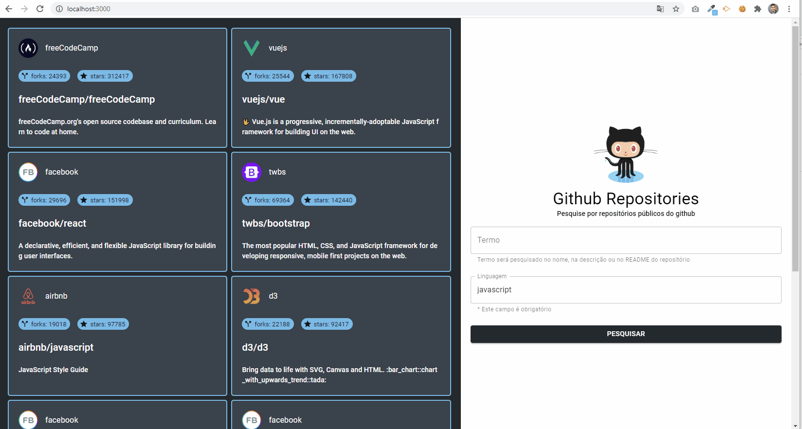

# Github Repositories
por [Vinicius Furusho Maciel](https://www.linkedin.com/in/vimaciel)

Este projeto tem como objetivo pesquisar repositórios púbicos do Github, agrupando por linguagens de programação. 
Nesta primeira versão, é possível pesquisar com os seguintes campos:

  - Termo: palavra-chave pesquisada no nome, na descrição ou no README do repositório;
  - Linguagem: a linguagem de programação utilizada no projeto do repositório.



### Observação
> Github Repositories faz uso da api do github de forma não autenticada, resultando no limite de 10 requisições por minuto.

### Instalação e execução
### Api
```sh
$ cd api
$ npm install
$ npm start
```

### Web
```sh
$ cd web
$ npm install
$ npm start
```


### Principais tecnologias utilizadas
### Api
- nodejs;
- express;
- axios;
- nodemon;


### Web

- react;
- redux;
- redux-saga;
- material-ui;
- styled-components;
- axios;

### Testes

### Api
```sh
$ cd api
$ npm test
$ npm run coverage
```

### Web
```sh
$ cd web
$ npm test
$ npm run coverage
```
